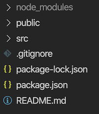

#   Objective 1 - bootstrap a React application with Create React App

## <span style="color:red">Overview</span>

You can build a React app from scratch with just an HTML page and some JavaScript, but that method is not scalable. If you want to use the latest JavaScript features, and pre-processors, and all the fun toys that make our jobs fun, then you will have to do a lot of configuration upfront. However, this gets very cumbersome very quickly. After a while, React developers started talking about how this was causing `JavaScript fatigue` - a term that has many many articles written on it. There was just so much to do to set up every single React project.

Understanding this frustration, the React team built a Create React App tool that sets up our entire app for us. It gives us all the "boilerplate," or necessary configuration and setup code needed for a React app to start building the app and not spend hours on configurations.

We run this tool in the command prompt/terminal. You can run Create React App (CRA) with `yarn`, `npm`, or even download it and run it independently. Since everyone's computer is different and not everyone's will work with just one of these tools, we will learn a couple of different methods. Find which one works best on your machine, and use that throughout your time here.

## Follow Along

Previously, global installs of create-react-app were standard, and you may still see this suggested in older tutorials.

This is no longer recommended. Here is the [documentation](https://reactjs.org/docs/create-a-new-react-app.html#create-react-app) of the new process, and it is also explained below.

You can list your global packages by running `npm list -g --depth=0`. If you have create-react-app installed globally, uninstall it with `npm uninstall -g create-react-app` to prevent npm from running the outdated version of create-react-app installed on your computer.

We will now use the npx utility, which was introduced in npm v. 5.2.0. Here, `animals` is the name of the React project you want to build:

```
npx create-react-app animals --use-npm
```

As soon as you run the command successfully, CRA starts installing all necessary files, folders, and dependencies using npm. It will even initialize a git repository and perform an initial commit. Once the process completes (it might take a while!), you should see a 'Happy hacking!' success message in your terminal.

If npx does not work for you, you would need to install create-react-app globally and then execute it from the command line:

```
npm install -g create-react-app
```

```
create-react-app animals --use-npm
```

### Starting your React App

Now we want to fire the app up:

```
// move into the project folder
cd animals

// start up the project
npm start
```

The `start` command here will launch the bundler (Webpack) and a transcompiler (Babel's Webpack loader), and spin up a dev server so you can visit your project at the default `http://localhost:3000`. This server will also listen for you to make changes to your project and refresh the browser page every time you save your files in your editor. This process is called "hot reloading."

Some other commands you can run here are as follows.

-   `npm test` will launch tests with the testing library `jest`.
-   `npm run build` will launch the bundler and transcompiler to produce a minified bundle appropriate for deployment.
-   npm run eject will unhide all the configuration and dependencies that CRA-generated react apps use under the hood. No way back from this, so don't do it unless you are sure you need to! Ejecting is usually NOT necessary for toy apps or small prototypes but is often inevitable when building real-world apps.

### Project dependencies

Learn to install additional packages. For example, we can use npm to install any other JavaScript packages as dependencies besides React and react-dom (which you'll find already among the project's dependencies inside package.json).

Example of installing and uninstalling the `moment` library as a project dependency:

```
npm install moment
npm uninstall moment
```

Example of installing and uninstalling the chai library as a dev project dependency:

```
npm install -D chai
npm uninstall chai
```

**Dev** dependencies are packages you as a developer need for performing specific operations like spinning up the app in your laptop, creating a bundle, or running tests. **Non-dev** or "regular" dependencies are the packages imported and consumed directly by your application code.

4.  **Study the file structure.** Your file structure (as of this CRA release) will look like this:



You should have a main `index.js` file in the `src`, which is mounting our `App` component to the `root div` found in the `index.html` file which lives in `public`. Notice how we're importing in `App.js` from inside of `index.js`.

Inside of `src/App.js`, we can see a class component. This approach is helpful because, in a typical React app, this main `App.js` component is used to hold onto state and sort of acts as the data control center for the rest of our application. Of course, you can build out many other components but `app`'s main purpose is to be the one single component that we pass to `ReactDOM.render` to compose our application.

5.  **Add your own code!** Inside of `App.js`, make modifications to make this component "yours." 

Then, go ahead and run `npm start` to bundle the app and boot up our web developer server. This is a step that you're pretty familiar with at this point. You should be able to tell if something is wrong pretty quickly. Now that your server is up and running, head to `localhost:3000` to see if you can inspect with the `react-dev-tools` in the browser.

Challenge
Use CRA to build a new app. Explore the app. Make changes and see what happens. Share what you discover with your team lead!


[Previous](../README.md) | [Next](./Object_2.md)