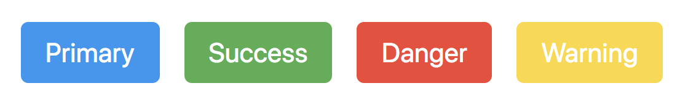
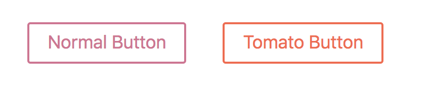

# Objective 3 - Use Styled-Components to Add Functional Styles to Their React Components

## <span style="color:red">Overview</span>

`Styled Components` is a library for writing CSS in our JS files. As mentioned in the article above, it's not that the idea of having HTML or CSS written in JS is bad, it's more that the implementation isn't properly implemented for either. React introduced JSX as a better tool for writing HTML in JS, and now we have great libraries to write CSS in JS.

To get started with `styled-components` we run `npm install styled-components`. And that's it! Now you're ready to roll! We can import it into our js files, and start building components.

Now that I have installed `styled-components` Let's look at how you can use them.

First, import the `styled` default object from `styled-components`. This gives you access to every property on that object. Each property is a React component that will print out whatever property you reference as a DOM element.

```
import styled from 'styled-components'
```
```
// div
const StyledDiv = styled.div``;

// paragraph
const StyledP = styled.p``;

// section
const StyledSection = styled.section``;

// headers h1 - h6
const StyledHeading = styled.h1``;

// a
const StyledA = styled.a``;

// etc.....
```

Hopefully, you're starting to get the point. You'll notice that I'm using that fancy [template literal](https://developer.mozilla.org/en-US/docs/Web/JavaScript/Reference/Template_literals) syntax. That's because each one of the properties found on the styled objects are actually methods. In JS, we can pass in string arguments using string literals.

## Follow Along

[Link to codesandbox from the video to follow along](https://codesandbox.io/s/yqvkxxrmn1)

##  Lets build out div component

To import styled-components, add `import styled from 'styled-components'`; to your js file. Then we will use `styled.div` to create a new component. Look at how we set this up, then we'll talk about the funny syntax:

```
import React from 'react';
import styled from 'styled-components';

const WrapperDiv = styled.div`
    width: 100%;
    height: 100%;
`;

function SomeComponent() {
  return (
    <div className="wrapper">
      <h1>Hello From the Home Component</h1>
    </div>
  );
}

export default SomeComponent;
```

We have created a component called `WrapperDiv` that is going to take the place of the `.wrapper` div. We have passed two css properties and values - `width` and `height`. But what is up with the backtick syntax?

From their docs: "This unusual backtick syntax is a new JavaScript feature called a tagged template literal. Do you know how you can call functions with parenthesis? (myFunc()) Well, now you can also call functions with backticks!"

So we are just invoking a function! And when we invoke this function, we are passing a string with our styles to it. Under the hood, styled-components will render a div with a funny-looking class name and apply the styles we passed. Now we can take our new component and put it into the JSX.

```
import React from 'react';
import styled from 'styled-components';

const WrapperDiv = styled.div`
    width: 100%;
    height: 100%;
`;

function SomeComponent() {
  return (
    <WrapperDiv>
      <h1>Hello From the Home Component</h1>
    </WrapperDiv>
  );
}

export default SomeComponent;
```

### There's more…

While cool, it seems like too much work if that is all we are gaining from style-components, right? Until we realize that there is so much more we can do! How about passing in props to change the color of buttons?

```
import React from 'react';
import styled from 'styled-components';

const Button = styled.button`
    padding: 6px 10px;
    margin: 5px;
    border: none;
    border-radius: 3px;
    color: white;

    ${props => (props.type === 'primary' ? `background: #2196f3;` : null)}
    ${props => (props.type === 'success' ? `background: #4caf50;` : null)}
    ${props => (props.type === 'danger' ? `background: #f44336;` : null)}
    ${props => (props.type === 'warning' ? `background: #fdd835;` : null)}
`;

function SomeComponent() {
  return (
    <div>
      <Button type="primary">Primary</Button>
      <Button type="success">Success</Button>
      <Button type="danger">Danger</Button>
      <Button type="warning">Warning</Button>
    </div>
  );
}

export default SomeComponent;
```



Note that inside the ${} we are running a function that takes in props, and returns the correct background color based on props.type. This has endless possibilities!

So we just created a single, reusable `<Button />` component that will change colors based on what we pass to the type prop! But wait… there's more!!! Let's create a "base" `Button` component, then create a `TomatoButton` component that extends some extra styles to it (this example is straight out of the docs)!

```
import React from 'react';
import styled from 'styled-components';


const Button = styled.button`
  color: palevioletred;
  font-size: 1em;
  margin: 1em;
  padding: 0.25em 1em;
  border: 2px solid palevioletred;
  border-radius: 3px;
`;

// A new component based on Button, but with some override styles
const TomatoButton = styled(Button)`
  color: tomato;
  border-color: tomato;
`;

function SomeComponent() {
  return (
  <div>
    <Button>Normal Button</Button>
    <TomatoButton>Tomato Button</TomatoButton>
  </div>
);

export default SomeComponent;
```



(You may have noticed that we are invoking a function, passing in a component, and it is returning a new component with added functionality. Styled is a HOC!!!!)

Now we're talking! With this, and so much more that we can learn from the styled-components docs, we can move styling into our JS, create many dynamic reusable components, and even create our style library quickly. Components can be plugged in anywhere!

##  Challenge

Take your Todo APP that you built out last week, and apply the principles you've learned today to style that app. Make it look nice and pretty! Then, share your newly polished app with your peers in the #show_it_off channel!


[Previous](./Object_2.md) | [Next](./Understanding.md)


