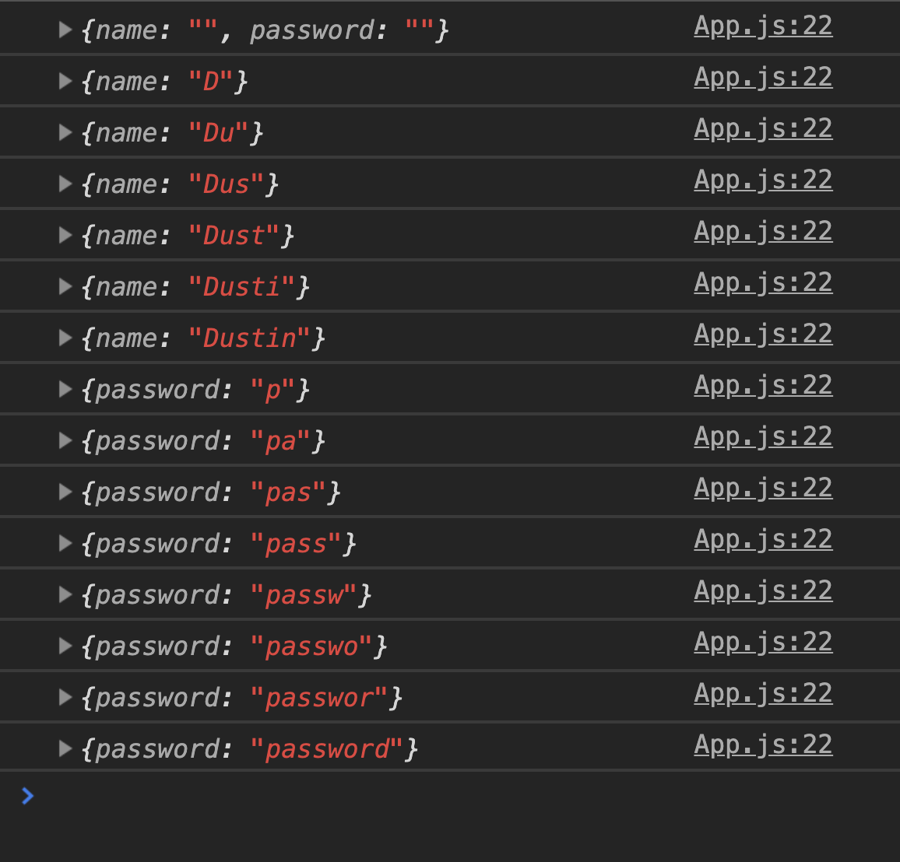
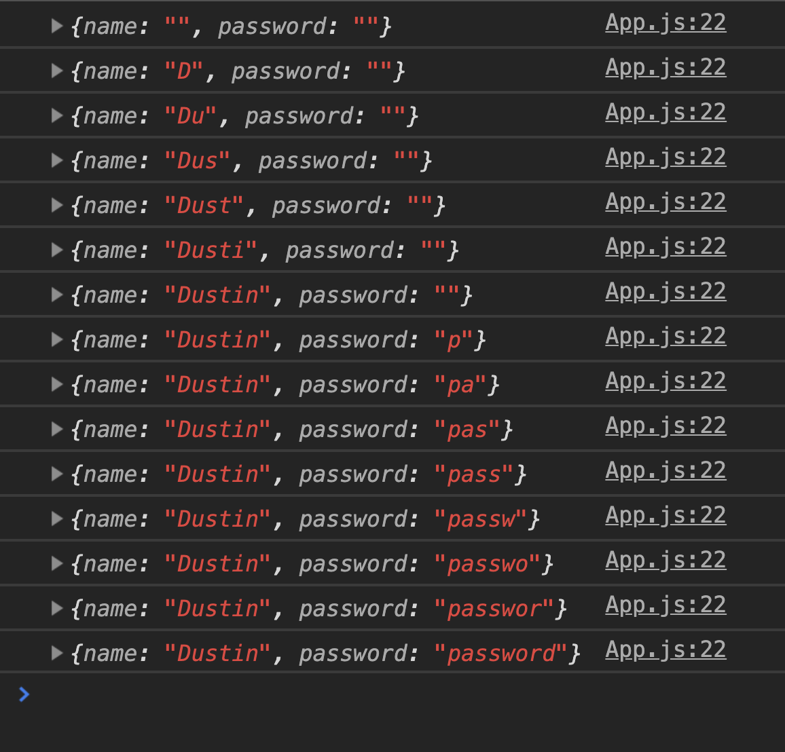

# Objective 4 - Demonstrate the Ability to Handle Multiple Inputs in a Form

## <span style="color:red">Overview</span>

Handling multiple inputs can get a little awkward in web apps. For example, if I asked you to add a second input to a form right now, you would add an input to the JSX, add a state property for that input, and then add a new function to handle that input. That works, but imagine doing that 5 - 10 times for larger forms. Or more! You can see how messy this would get. Let's walk through how we can fix this problem below.

## Follow Along

Right now, this isn't a useful login page as there's no field for a password. So we're going to make a naive implementation first, reflect on its limitations, and then upgrade it.

```
import React, { useState } from "react";
import "./App.css";

function App() {
  const [name, setName] = useState("");
  const [password, setPassword] = useState("");

  const handleNameChange = event => {
    setName(event.target.value);
  };

  const handlePasswordChange = event => {
    setPassword(event.target.value);
  };

  const handleSubmit = event => {
    event.preventDefault();
    console.log(name);
    console.log(password);
  };

  return (
    <div className="App">
      {console.log({ name })}
      {console.log({ password })}
      <form onSubmit={event => handleSubmit(event)}>
        <label>
          Username:
          <input type="text" onChange={event => handleNameChange(event)} />
        </label>
        <label>
          Password:
          <input type="text" onChange={event => handlePasswordChange(event)} />
        </label>
        <button>Submit!</button>
      </form>
    </div>
  );
}

export default App;
```
We had to change some of our names because we're handling two fields instead of one, but none of the underlying logic changed. So now, this code works, and as a wise man once said, caveman code is better than nothing as long as it works.

But there's another piece of sage advice we're familiar with: don't repeat yourself (DRY). We sure are repeating ourselves a lot here! We're keeping the information about one user in two completely separate state variables, and we've written two completely separate functions with identical logic. So how can we do better?

We have two goals. First, we want to store both the username and password in a single state object. Second, we only want to write one single change handler function that dynamically finds the correct key in our state object to change. To achieve these goals, we need to learn about two tools provided to us by ES6: the spread operator and computed properties.

### The Spread Operator

The spread operator is a swiss army knife for JavaScript. We're not going to delve into all its uses here, though I encourage you to look it up. For now, we're going to focus on its ability to help us make copies of objects and arrays. 

You might have encountered this programming gotcha before.

```
let foo = { key: "value" };

let bar = foo;

console.log(foo); //  {key: "value"}
console.log(bar); //  {key: "value"}

foo.key = "change";

console.log(foo); //  {key: "change"}
console.log(bar); //  {key: "change"}
```

This is counterintuitive. When we declared our bar variable, we thought we were making a copy of foo, but we weren't. We were merely creating two separate references to the same object data stored in memory. When we changed the data in that location and called upon their reference (foo and bar), they logged what they were told to point at. This is a little annoying, but really, it's the only way objects can work. If objects were copied by default and said objects referred to each other, we'd be in an infinite loop.

Okay, so creating a new binding doesn't give us a new object. So how can we create a new object? There are a few ways, but one convenient (and arguably the most readable) method is to use the spread operator.

```
let foo = { key: "value" };

let bar = { ...foo };

console.log(foo); //  {key: "value"}
console.log(bar); //  {key: "value"}

foo.key = "change";

console.log(foo); //  {key: "change"}
console.log(bar); //  {key: "value"}
```

This time when we declare `bar`, we take all the key/value pairs inside foo (in this case, there's only one) and "spread" them out (copy them) inside a brand new object literal. This gives us the behavior we expected to see in the first place.

So what does this have to do with React? Two things. Remember back to the `useState` module when we talked about React's namesake? When the state changes your view layer reacts to the change and updates. To get a little more technical, something in our state changes React triggers a re-render of every component that is using that data. If react doesn't think the state has changed, it won't trigger a re-render. Remember that our first goal was to keep the username and the password in a single state object instead of repeating ourselves with two useStates? We might think that we could accomplish that like so:

```
import React, { useState } from "react";
import "./App.css";

function App() {
  const [user, setUser] = useState({ name: "", password: "" });

  const handleNameChange = event => {
    setUser({ name: event.target.value });
  };

  const handlePasswordChange = event => {
    setUser({ password: event.target.value });
  };

  const handleSubmit = event => {
    event.preventDefault();
    console.log(user.name);
    console.log(user.password);
  };

  return (
    <div className="App">
      {console.log(user)}
      <form onSubmit={event => handleSubmit(event)}>
        <label>
          Username:
          <input type="text" onChange={event => handleNameChange(event)} />
        </label>
        <label>
          Password:
          <input type="text" onChange={event => handlePasswordChange(event)} />
        </label>
        <button>Submit!</button>
      </form>
    </div>
  );
}

export default App;
```

But we screwed up. All we wanted to do was update one of the keys on our state object, instead, we're replacing the entire object. If we type a letter in the `Username` field, we'll have changed the value of `user` from `{name: '', password: ''}` to `{name: [whatever the user types]}`. Then if we type something in the `Password` field, we'll have changed the value of `user` again to `{password: [whatever the user types]}`. Our log to the console can help demonstrate:



This is definitely not what we want. Thankfully our trusty spread operator can save us. Let's change those handlers to this:

```
const handleNameChange = event => {
  setUser({ ...user, name: event.target.value });
};

const handlePasswordChange = event => {
  setUser({ ...user, password: event.target.value });
};
```
Here, our spread operators are telling React, "Please copy all the keys and values in the user object into this new object literal, then overwrite the name and password keys respectively with the specified value." The result?



There we go.

So we've condensed our state into a single object, but we still have two change handlers with identical logic. This form only has two fields; imagine if it had ten or a hundred. Our change handlers would grow unwieldy very quickly. To make our form code DRY-er, we need to take a look at computed properties.

### Computed properties

Another extremely useful tool from ES6, computed properties, lets us compute the properties of objects, as the name implies. Take a look at this.

```
let myObject = { firstProperty: "Hi Lambda!" };
```

We know that JavaScript provides us with two ways to access this property: dot notation and bracket notation.

```
myObject.firstProperty; //"Hi Lambda!"
myObject["firstProperty"]; //"Hi Lambda!"
```

Take a look at the bracket notation. Have you ever stopped to wonder why you have to surround the key you're trying to access in quotes? Well, under the hood, all object properties are strings (you'll dive deeper into the reason why in the CS module). The dot notation is a bit easier to type, but sometimes it's not legal to use it - when our property has a special character or starts with a number, for example.

```
let myOtherObject = {"3": "totally legal key/value pair"};
myObject.3; // JavaScript freaks out at you.
myObject."3"; // JavaScript freaks out at you.
myObject[3]; // JavaScript is pleased.  It will implicitly coerce this integer to a string.

```

**Side note:** Incidentally, this is why we access elements in arrays with the bracket notation. Arrays are secretly just objects whose keys are hard coded as strings of consecutive integers.

But this brings us back to `myObject["firstProperty"]; //"Hi Lambda!"`. Why can't we just write `myObject[firstProperty]; //"Hi Lambda!"` without the quotes around `firstProperty`? Because if you put quotes around `firstProperty`, JavaScript will attempt to look that string up in the object. If you don't include the quotes JavaScript is going to attempt to evaluate what you wrote as a variable. This is a powerful tool. Now instead of referring to our object properties with a hardcoded string, we can attempt to look one up on the basis of an evaluated expression.

```
let myThirdObject = { 1: "sup", 2: "hey" };

let computedProperty = 1;

myThirdObject[computedProperty]; // "sup";
myThirdObject[1 + 1]; //"hey";
```

### Login Form

So how does this tool help us handle multiple inputs with one function? The final piece of the puzzle takes us back to our form element. Recall that the `<form>` tag keeps track of some of its state, making its implementation in React sometimes awkward. Well, this time, we're going to use that to our advantage. By including a name attribute on our inputs we can attach a new name property to the event.target object.

```
import React, { useState } from "react";
import "./App.css";

function App() {
  const [user, setUser] = useState({ username: "", password: "" });

  const handleNameChange = event => {
    setUser({ ...user, username: event.target.value });
  };

  const handlePasswordChange = event => {
    setUser({ ...user, password: event.target.value });
  };

  const handleSubmit = event => {
    event.preventDefault();
    console.log(user.name);
    console.log(user.password);
  };

  return (
    <div className="App">
      {console.log(user)}
      <form onSubmit={event => handleSubmit(event)}>
        <label>
          Username:
          <input
            type="text"
            name="username"
            onChange={event => handleNameChange(event)}
          />
        </label>
        <label>
          Password:
          <input
            type="text"
            name="password"
            onChange={event => handlePasswordChange(event)}
          />
        </label>
        <button>Submit!</button>
      </form>
    </div>
  );
}

export default App;
```
Using our knowledge of computed properties, we can now rewrite our handler functions like this:
```
const handleNameChange = event => {
  setUser({ ...user, [event.target.name]: event.target.value });
};

const handlePasswordChange = event => {
  setUser({ ...user, [event.target.name]: event.target.value });
};
```
And now that these functions are literally the same letter-for-letter, there's truly no reason to have two of them.

```
import React, { useState } from "react";
import "./App.css";

function App() {
  const [user, setUser] = useState({ username: "", password: "" });

  const handleChange = event => {
    setUser({ ...user, [event.target.name]: event.target.value });
  };

  const handleSubmit = event => {
    event.preventDefault();
    console.log(user.username);
    console.log(user.password);
  };

  return (
    <div className="App">
      {console.log(user)}
      <form onSubmit={event => handleSubmit(event)}>
        <label>
          Username:
          <input
            type="text"
            name="username"
            onChange={event => handleChange(event)}
          />
        </label>
        <label>
          Password:
          <input
            type="text"
            name="password"
            onChange={event => handleChange(event)}
          />
        </label>
        <button>Submit!</button>
      </form>
    </div>
  );
}

export default App;
```
You could add as many inputs to this app as you like, and so long as each has a name attribute that corresponds to a property in the state object, our sole change handler would manage them all.

That was a lot to get two input fields working, but the things we learned about React and JavaScript to accomplish this will pay off over and over again in other ways down the line. Great job making it this far, but there's one last thing to discuss.


[Previous](./Object_3.md) | [Next](./Object_5.md)


