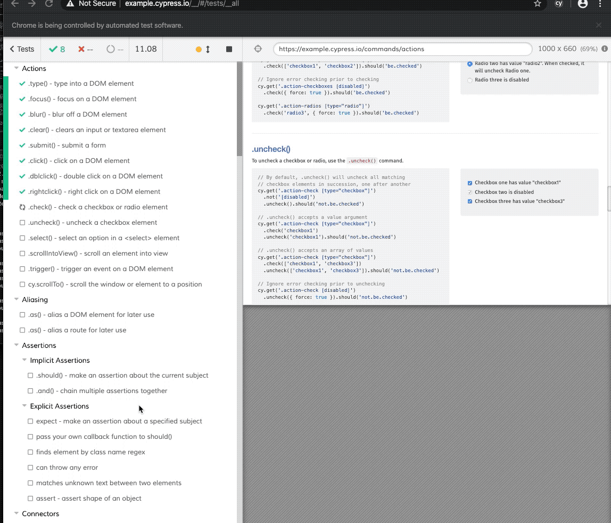
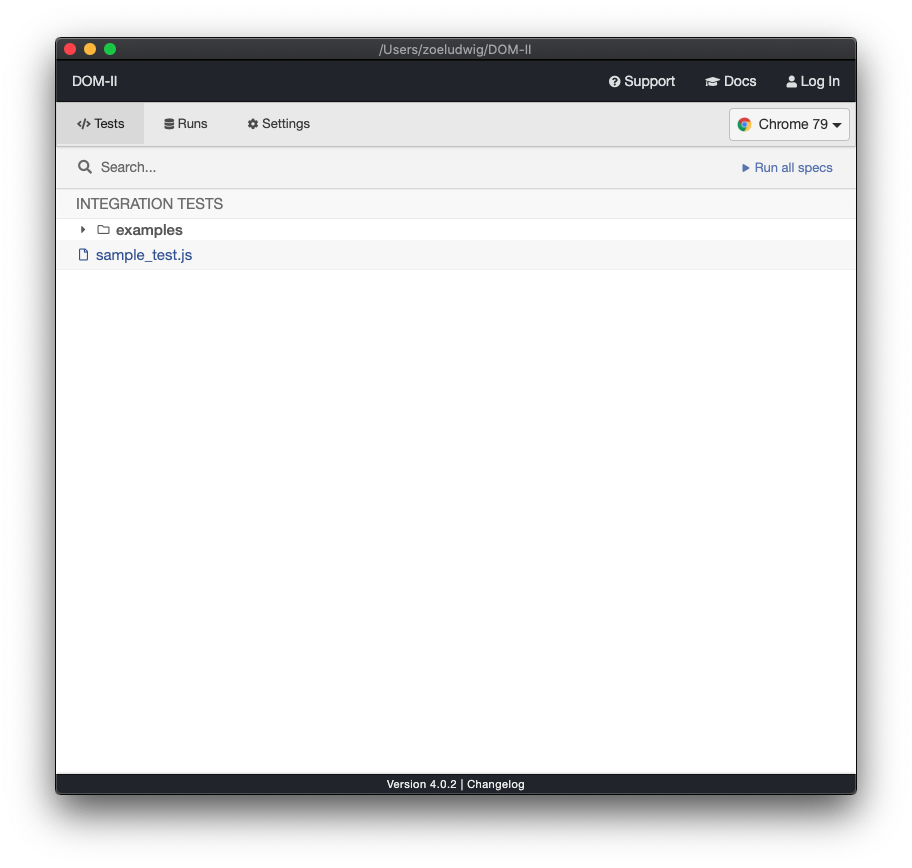
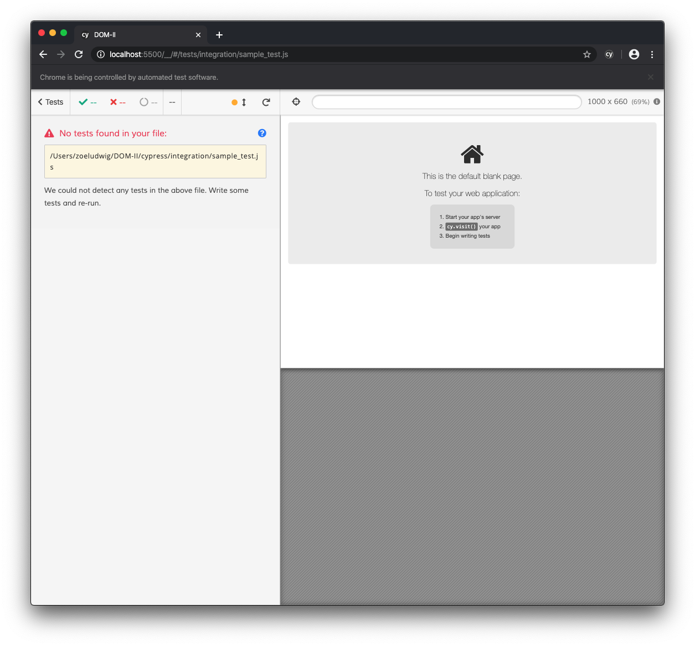

# Objective 2 - Use the Cypress GUI to Write Tests and Interact With Elements

## <span style="color:red">Overview</span>

Cypress is an awesome testing tool for unit, integration, and E2E tests. Coincidentally it is also great for learning, thanks to its visual, guided user interface (GUI). Like React, Cypress is written in a way that is easy to understand, using English language functions like `visit(url)` and `fire(event)` that make syntactic coding easier.

In traditional end-to-end testing, developers have to use and choose from various frameworks, assertion libraries, wrappers, and more. Cypress was designed as an "all-in-one" testing framework where tests can be written in a single language (JavaScript) and run graphically in a browser.

This objective will focus on creating simple tests and interacting with browser elements through the Cypress GUI.

### Install and Run Cypress

Before we start to use Cypress in a project, we can install and open Cypress in terminal to view some example tests.

We can install Cypress with the following command in terminal:

```
npm install --save-dev cypress
```

Once it's been installed we can open Cypress with this command:

```
npx cypress open
```

Opening Cypress for the first time you'll see a list of example tests. We recommend you run though these examples on your own by clicking `Run all specs`.

When you do this you will visually see user simulations animated on a webpage in your browser as the tests are run. On the left hand side you can view test names and pass/fail icons while on the right you can view simulated user `actions` (remember our arrange/act/assert framework!).



While watching these tests run may be somewhat interesting, our goal is to write and run our tests. To do that, we'll practice by creating some really simple tests within an existing project folder.

### Testing structure

Syntactically, testing in Cypress looks something like this: Every test will start with a `describe` higher order function, and will accept a test as a callback function. Within the callback function there will be some `it` statement, as well as actions and assertions. We'll get into those more in the next objective. Here, we'll use simple `expect` assertions and `visit` actions which work exactly as you'd expect!

`cy.visit()` will simulate a user visiting a page.

`expect()` will verify if some expectation is met. (More on both below.)

```
describe('Name Test', function () {

    it('Explain what it does', function() {

        // actions and assertions go here
    })
})
```

### Interacting with elements

Like we can inspect elements in a browser, we can use the selector playground to show the code needed to interact with certain elements.


When we go to write more useful tests, we'll use this often to grab components on a page.

We'll walk through the specifics of these steps during the tutorial portion of this objective, but the basic flow of Cypress testing follows the same `Arrange, Assert, Act` framework that you learned above.

## Follow Along

### We do

For the next few objectives we'll be working inside of your most recent `fun bus` project directory.

####  Set up Project

1.  Install cypress locally with npm install --save-dev cypress. You'll notice 5k+ changes to your working directory in git but this is just Cypress installing all of its dependencies.
2.  Since there is no package.json file in our fun bus example, we'll need to create one. Then, we'll add the following code to our new file:

```
{ "scripts":
    { "cypress:open": "cypress open"
    };
}
```

3.  Run npm run e2e in terminal which will create a cypress.json file and a cypress folder within your website directory. Inside the cypress folder you'll find four more folders, including the example files we looked at earlier.
4.  To write our own tests we'll need to create a new test file. You can call it anything you want but best practices suggest that the file name should match the function of the test. In this case, the file name would be sample_test.js.
5.  From the cypress GUI, click on the file sample_test.js to run in browser.



6.  At this point you should see the No tests found error message as well as the default blank page. We would need to tell Cypress to load a page in order to see our actual html displayed.



### My First Test

Now, let's return to that sample_test.js file and write a very basic test. For set up purposes we can write a test called My First Test and check to see if true equals true; this will always pass.

```
//arrange
describe('My First Test', function () {
//act
    it('Does not do much', function() {
//assert
        expect(true).to.equal(true);
    })
})
```

### My Second Test

Until this point we've been running tests on the default blank page. If we want to run tests on our own `index.html` file, we need to add the action `visit` into the `// act` portion of our test.

1.  In order to do this we'll need to add a base URL to cypress.json file. You should use the format "http://localhost:8080/" such that the addition looks something like the below. Note that you can visit a URL without setting the baseURL, but then you would need the full file path in `cy.visit()`. That said, using `localhost:8080` is considered a best practice because it prevents an annoying automatic default refresh that happens under the hood.

```
{
  "baseUrl":"http://localhost:8080/"
}
```
2.  Now that a baseUrl exists, you can run a second test to load your index.html page with cy.visit().

```
 describe('My Second Test', function () {
    //Arrange
    it('Visits a new site', function() {
    // Act
    cy.visit("index.html");
    })
})
```
The example below shows what these tests will look like if successful, for our favorite example, the fun bus.


These might seem boring, but you've just practiced with important syntax and testing principles. We'll write more complicated tests in the next section.

##  Challenge

Set up Cypress testing in a module challenge of your choosing. Run two tests:

1) to confirm that `true === true`.
2) to confirm that your index.html file will load locally.


[Previous](./Object_1.md) | [Next](./Object_3.md)