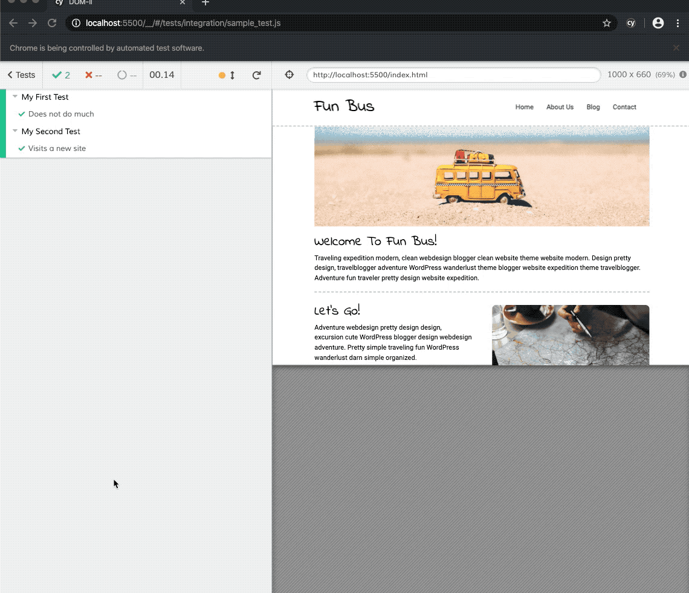

# Objective 3 - Use Cypress to Test Controlled Input

## <span style="color:red">Overview</span>

### Interacting with Elements

The tests covered in the previous objectives are the simplest possible tests we can run. But, more practically, we'll want to test how a user interacts with the webpage such that we don't have to click around a page looking for bugs manually. To do that, we'll use a variety of cypress actions and assertions.

####  Actions

We will primarily use Cypress to test whether or not user actions give the returns we expect them to. This is because actions in Cypress (or any testing library) are designed to simulate user actions. For example, some of these actions are click events, double click events, scrolls, or checked boxes, all of which we've been working with in this unit.

####  Visibility

Another important test we'll run is visibility, which are tests to check whether or not an element is hidden. Visibility tests can be chained with the actions above to see how elements appear and disappear depending on user actions.

In addition to actionability and visibility, Cypress allows us to test scrolling, covering, readOnly, animations, and more. You can view a full list of actions and read more about them in the [Cypress documentation](https://docs.cypress.io/guides/core-concepts/interacting-with-elements#Actionability)

### Best Practices

The following cheat sheet of best targeting elements is taken directly from the Cypress documentation. It is rare to get this kind of best practice guidance directly from the language developers; it gives us insight into the best way to write our tests.

| Selector	                | Recommended	| Notes
|---------------------------|-------------|------------|
cy.get('button').click()	  | ❌Never	    | Worst - too generic, no context.
cy.get('.btn.btn-large').click()	| ❌Never	| Bad. Coupled to styling. Highly subject to change.
cy.get('#main').click()	    | ⚠️Sparingly	    | Better. But still coupled to styling or JS event listeners.
cy.get('[name=submission]').click()	| ⚠️Sparingly	| Coupled to the name attribute which has HTML semantics.
cy.contains('Submit').click()	| ✅Depends	| Much better. But still coupled to text content that may change.
cy.get('[data-cy=submit]').click() |	✅Always	| Best. Isolated from all changes.

### Assertions

After we set up the simulated user actions, we will want to test that some expectation has been met: text has rendered on the page, a new page has loaded, etc. Again, we'll do these using assertions.

The most common assertion is `.should():` we'll assert that some element should contain some content or do a specific thing. Since Cypress code syntax is English-like, let's look at an example which tests that a link navigates to a new page.

```
describe('Link Navigation', function() {
  it('Asserts that the words instagram.com link to instagram.com', function() {
    cy.visit('index.html')

    cy.contains('Instagram.com').click()

    // Should be on a new URL which includes '/commands/actions'
    cy.url().should('include', 'instagram.com/')
```

We saw `.contains()` in the example above. This will check if the selected element contains some specified content (like text or an image). Contains is a little tricky because it can also be used in either the `assertion` or `action` phase of your test. Contain can be used in place of id selectors to select elements based on text. For example, you could use `cy.contains('submit').click()` to simulate a user clicking a submit button, or `cy.contains('Instagram.com')` to grab any element containing the text Instagram.com, as we did above. We'll use contains as an assertion below.

##  Follow Along

Let's write a real test to actually test DOM elements.

1.  **Arrange** - First, we need to set up our test with a name and function declaration. As covered in the previous objectives, this is where we describe what the test will do.

```
describe('Header Text', function() {
    it('Checks if header text exists', function () { })
})
```
2.  **Act** - Next we need to act. Our action here will simply be loading up the page with cy.visit().

```
describe('Header Text', function() {
    it('Checks if header text exists', function () {
    cy.visit("index.html");
 })
})
```

3.  ***Assert** - Finally, we'll grab the header element of interest and assert that it contains the text "Fun Bus" with cy.get('.logo-heading').contains('Fun Bus');.

```
describe('Header Text', function() {
    it('Checks if header text exists', function () {
    cy.visit("index.html");
    cy.get('.logo-heading').contains('Fun Bus');
    })
})
```

### Failing Test

A test will fail when the expectation, or assertion, is false. In our example above, if the logo-heading file doesn't contain the given text, the test would fail. To illustrate how these work, we could change the `.contains()` text to "Fun Bus!" and, as expected, the test would time out because it can't find what it's looking for.

```
//Test will fail because header text does not contain the full string

describe('Header Text', function() {
    it('Checks if header text exists', function () {
        cy.visit("index.html");
        cy.get('.logo-heading').contains('Fun Bus!');

    })
})
```


##  Challenge

Write a test on your chosen module challenge using an assertion that we did not cover above - get inspired by the documentation [here](https://docs.cypress.io/guides/references/assertions#Chai)


[Previous](./Object_2.md) | [Next](./Object_4.md)


