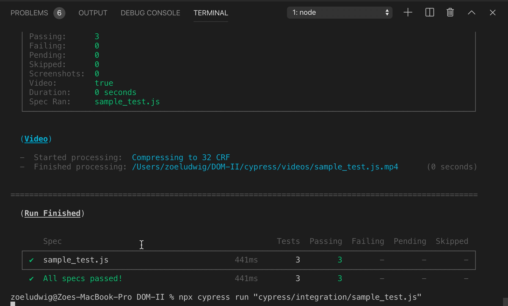

# Objective 4 - Create a New Element, Manipulate it, and Add it to the DOM

## Overview

Cypress' GUI is great, but sometimes it's nice to be able to run tests right in the console without having to navigate away from your code editor. When making small changes, this can be especially useful.

Thankfully, cypress tests can be run straight from the terminal with `npx cypress run` + `filename`.

### Cypress run

`cypress run` is the command to run all cypress tests. By default, this command will run all tests, including the example tests. There are a plethora of options that we can add in order to tailor the command to our needs. A full list of these options can be found in the documentation, but the most important for us is `--spec`.

`--spec`

`--spec` or `-s` will specify which tests to run. So, `npx cypress run --spec "cypress/integration/sample_test.js"` will run only the tests in the `sample_test.js` file.

You can specify multiple files by separating filenames with a , all inside of the quotation marks.

### Other Commands

The `cypress run` command is by far the most commonly utilized but `cypress open`, `cypress verify`, `cypress version` and `cypress cache` are all accepted as valid.

command	  | purpose
|---------|----------|
open	    | Opens the Cypress Test Runner in interactive mode.
verify	  | Verify that Cypress is installed correctly and is executable.
version	  | returns package version and binary version for debugging (rarely used)
cache	    | view or clear cache

## Follow Along

All we need to do in order to run tests on our fun bus page is use the command `npx cypress run --spec "cypress/integration/sample_test.js"`

## Challenge

Run the tests you created in previous objectives in terminal.

[Previous](./Object_3.md) | [Next](./Understanding.md)

