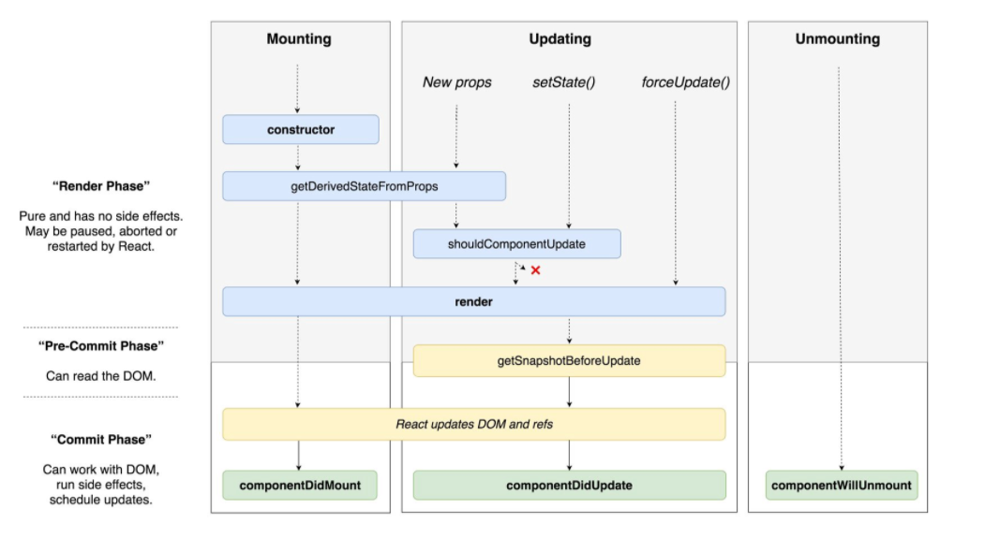

#   Objective 1 - Describe the Three Phases of the React Component Lifecycle

##  Overview

React is, in essence, a combination of multiple components. A component can be as simple as a single user interface that represents a small portion of our application. Conceptually, a component lifecycle happens in three phases. This idea is displayed nicely in the following diagram from one of the maintainers of React "Dan Abramov."



As you can see, the three React lifecycle phases are 1) Birth/Mounting, 2) Growth/Updating, and 3) Death/Unmounting.

### The Birth/Mounting Phase

This is the phase when the component is being built from the ground up. A few things are happening here:

Whatever initial data you want access to will be defined on the constructor of this phase

- Your render method is invoked.
- ```componentDidMount``` gets called as well.

### Growth/Updating Phase

In the Growth/Updating phase you're updating compnent data.

- ```setState``` can be used to change the component's state data, forcing a call to ```render```.
- ```shouldComponentUpdate``` is a method one could use here to stop a component from calling render if necessary.

## Follow Along

Dive into the documentation at [ReactJS](https://reactjs.org/docs/react-component.html#the-component-lifecycle){:target="_blank"} and look into some of the key pieces of the LifeCycle API.

The methods that we're going to look at are:

- ```constructor```
- ```render```
- ```componentDidMount```
- ```componentDidUpdate```
- ```componentWillUnmount```

Let's also compare where each of these methods belongs within the react lifecycle by looking at [this diagram](https://projects.wojtekmaj.pl/react-lifecycle-methods-diagram/){:target="_blank"}.

We will explore these in-depth later on but focus on warming up to the documentation and the idea that components have a lifecycle.


## Challenge

Read [this medium article](https://medium.com/@baphemot/understanding-reactjs-component-life-cycle-823a640b3e8d){:target="_blank"} about the component lifecycle. Take notes and share what you learned in a paragraph to your Project Manager via Slack.


[Previous](../README.md) | [Next](./Object_2.md)