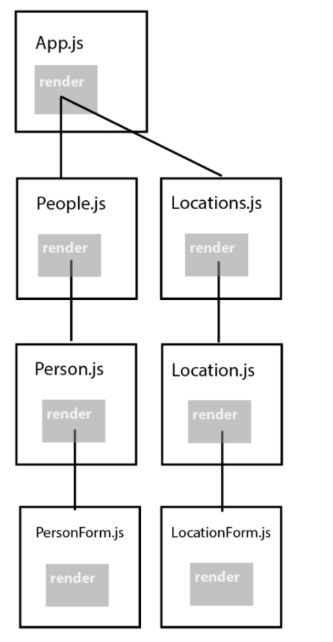
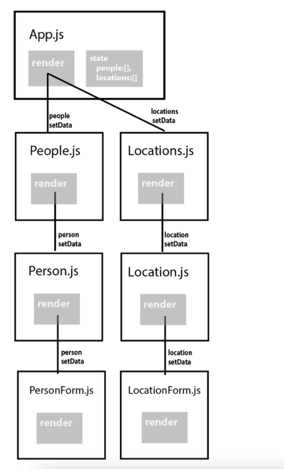
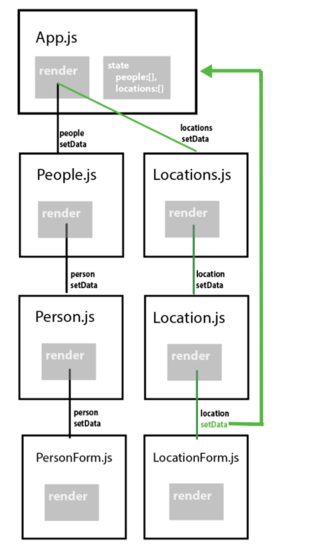

# Objective 2 - Share Data Between Components Using State and Props

[Click here](https://codesandbox.io/s/yk37ykmyrz) to access the code within this video's follow-along exercise.

## Overview

Up until this point, our applications have been fairly simple. One or two components with a bit of state to allow for interaction. As our applications grow, so to do the complexity way components relate to each other. To do this, it helps to see our components as being structure in a ```parent / child``` relationship.

Here is an example of a more complicated application hierarchy.



Simple or complex, every application needs shared, persistent data to run.

Currently, we have been using ```state``` to hold that data. Unlike statically defined data within our component, state is persistent, changeable and can flow into other components through use of ```prop drilling```. Changes to state immediately rerender the parts of our components effected by that change of state in a process called ```reactivity```. When working with more complex component trees, state always runs from a ```parent``` component down to a ```child```.



What if we want to modify that data? Just as we can pass parent state down through props, we can also pass functions that modify child state! Executing these functions in our child components will cause state to change at our parent level components, resulting in reactive rendering throughout our application!



We have already seen how to pass state through props using functional components. Now, let's take a look at how we work with state-in-class-based components.

## Follow Along

Consider the following component:
```
class App extends React.Component {
  constructor() {
    super();
    this.state = {
      welcomeMessage: 'world!'
    };
  }

  render() {
    return (
      <div>
        <h1>Hello, {this.state.welcomeMessage}!</h1>
      </div>
    );
  }
}
```
Let's create a sub component using functional components to hold our welcome message.
```
const WelcomeBanner = (props) =>
{
  return(<h1>Hello, {props.message}!</h1>);
}
```
Now, lets refactor our component using React classes.
```
class WelcomeBanner extends React.Component {
    render(){
        return(
        <div>
            <h1>Hello, {this.props.message}</h1>
        </div>
    }
}
```

Notice that props are not passed in as they were in functional components. Instead, props are attached to the this object, just like state.

Great! We are sharing data between a component's state and a component's props. This means that when the state object changes, so too will the props.

Now let's add in the ability to modify that state. To do this, we will need to:

-   Connect a state change method to an event listener in our child component.
-   Create the substance of that method in our parent.
-   Pass that method to the child through props.

Let's start at the bottom, our child component. Let's say that we want to use a form to dynamically update our message statement. This small component should do nicely:
```
const FormComponent = props => {
  return (
    <form>
      <input placeholder="change state" onChange={props.updateStateMessage} />
    </form>
};
```
The only problem is, we don't have access to state all the way down here! Let's build out our state changing method where it belongs, in App.js our ```parent```. While we are at it, let's add our form component to our rendering so we can see it in the first place.

```
class App extends React.Component {
  constructor() {
    super();
    this.state = {
      welcomeMessage: 'world!'
    };
  }

  updateStateMessage = (e)=> {
    this.setState({welcomeMessage:e.target.value});
  }

  render() {
    return (
      <div>
        <WelcomeBanner message={this.state.welcomeMessage} />
        <FormComponent updateStateMessage={this.updateStateMessage}/>
      </div>
    );
  }
};
```
And there we go! We successfully passed our ```state data``` downstream through ```props``` in WelcomeBanner. At the same time, we can also successful pass data back upstream by executing ```state modifying functions``` passed through props in FormComponent.

## Challenge

Using the components we just created (App, FormComponent, and MessageComponent), try building out a form to allow a user to handle data. You'll need a button, input field, and some data-bound to a DOM element that displays what the user is submitting.

When a user clicks submit, show the data that's on state in an ```alert``` statement.

### Stretch 

Loop over a list of items showing those items to the screen. (Can be a list of strings). Then, when a user clicks submit, push an item into that list instead of logging the item and watch the magic happen.

-   We're going to be updating some state on a parent component.
-   That state will be wired up to a few other components as we pass the props around.
-   We will also be passing around a few handler functions that help us update/delete our state.

Lets set up a form component that we can use to update our message component from above.

```
const WelcomeBanner = props => <h1>Hello, {props.message}!</h1>;

class App extends React.Component {
  constructor() {
    super();
    this.state = {
      welcomeMessage: 'world!'
    };
  }

  render() {
    return (
      <div>
        <WelcomeBanner message={this.state.welcomeMessage} />
      </div>
    );
  }
}
```
Now let's build a form component that can handle some data defined on state, below on the child components.

```
const FormComponent = props => {
  return (
    <form>
      <input placeholder="change state" onChange={props.updateStateMessage} />
    </form>
  );
};
```
We will need to build out a change handler function on our App component that we can pass down to the form. In addition, we'll have to define the prop as updateStateMessage in order to make our onChange event handler work out properly.
```
messageChangeHandler = event => {
  this.setState({welcomeMessage: event.target.value});
};

render() {
  return (
    <div>
      <WelcomeBanner message={this.state.welcomeMessage} updateStateMessage={this.updateStateMessage}/>
    </div>
  );
}
```
## Challenge

Using the following tools:

-   Class component
-   functional FormComponent, MessageComponent
-   click, and change handlers
-   ```setState```
Build out a form that will allow a user to handle data. You'll need a button, input field, and some data-bound to a DOM element that displays what the user is submitting.

When a user clicks submit, show the data that's on state in an alert statement.

Stretch loop over a list of items showing those items to the screen. (Can be a list of strings). Then, when a user clicks submit, push an item into that list instead of logging the item.

[Previous](./Object_1.md) | [Next](./Object_3.md)