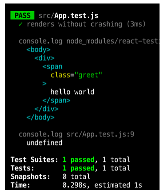

#   Objective 1 - Use React-Testing Library for Testing React Components

##  Overview

In the last unit, we discussed the general what and why of testing and learned how to implement end-to-end tests. Here we're going to dive into implementing integration tests. The what and why of testing remains the same between all different types of automated tests.

This module will use the [React-testing library](https://testing-library.com/docs/react-testing-library/intro/) to run tests. Unlike previous testing libraries, the React-testing library is designed with the user in mind, testing components via DOM nodes, similar to how a user would interact with the front end of a website.

The React-testing library recently underwent a major overhaul - we used to use different libraries, Enzyme and Jest, for tests that cared more about the internal management of props and state. We can use the React-testing library to test props, state, output (in DOM elements), and more.

The "hello world" of the React-testing library is a test to check if a component loads without crashing. Here, we declare a test, name it, and check if the app renders.

```
test("renders App without errors", () => {
  render(<App />);
});
```
Earlier, we discussed the "Arrange, Act, Assert" structure for testing. There's a technical first step, import - we'll look at all of them below. For more details, check out the [testing library documentation](https://testing-library.com/docs/react-testing-library/example-intro/) .

The following matches the structure we've studied and is a simplified version of what you'll find in the documentation. Next, we'll walk through the tutorial, which is even more straightforward, but this example is good for illustration.

We are testing the greeting component to see if our expected greeting ("hello lambdalorians") appears in the browser as we expect it will per the code below. An important note here, our tests work with text because that's what the user sees and what the user experiences - the test does not test on classes, for example, because that's an implementation detail, not a rendered element.

```
import React from 'react';

const Greeting = () => {
  return <h1 class="my-greeting">Hello Lambdalorians!</h1>;
};

export default Greeting;
```

### Import

As with any library, we need to import the React-testing library before using it; this all should look more or less familiar from imports we've done before. However, you'll notice that "Arrange, Act, and Assert" are yet to be filled out.

```
// import dependencies
import React from "react";

// import react-testing methods
import { render, screen } from "@testing-library/react";

// add greeting
import Greeting from "./Greeting";

test("renders greeting on Greeting component", async () => {
  // Arrange
  // Act
  // Assert
});
```

### Arrange

The ```render``` method renders a React element into a virtual DOM. Recalling our definition of "arrange", this is basically the part where we set ourselves up for success.

```
test("renders greeting on Greeting component", async () => {
  // Arrange
  render(<Greeting />);

  // Act
  // Assert
});
```

### Act

The ```screen.getByText()``` method can be used to "query" the DOM for a specific node by its text that we expect to see in the browser. We will use it here to test that our greeting ("hello lambdalorians") is being rendered by the ```<Greeting />``` component.

```
test("renders greeting on Greeting component", async () => {
  // Arrange
  render(<Greeting />);

  // Act
  const greeting = screen.getByText(/hello lambdalorians!/i);

  // Assert
});
```

A quick note here, you may notice that "hello lambdalorians" is written with / instead of "s. This is regex syntax (Links to an external site) (Links to an external site.) and is commonly used in testing. The 'i' designates our text as case insensitive, so even though we have the string "hello lambdalorians" written, our test will pass even if "hElLo LamBdAlOriAns" is displayed in the browser.

### Assert

Finally, we need to "assert" that the greeting has indeed been rendered. Here we use a couple of new functions - ```expect``` is a Jest function that is made globally available with create react app. The other, ```toBeInTheDocument()```, comes from [Jest DOM](https://testing-library.com/docs/ecosystem-jest-dom/), a companion library to react-testing-library that provides custom matchers for Jest. A full list of functions can be found on [GitHub](https://github.com/testing-library/jest-dom). Throughout our examples we assume that you import Jest DOM in create-react-app, and suggest that you always do this, rather than importing it every time.

```
test("renders greeting on Greeting component", async () => {
  // Arrange
  render(<Greeting />);

  // Act
  const greeting = screen.getByText(/hello lambdalorians!/i);

  // Assert
  expect(greeting).toBeInTheDocument();
});
```

### Running Tests

You should be at least somewhat familiar with this process from tests that we've used throughout Lambda to help your code along. All tests run in the terminal with ```npm test``` - as you run tests you should see passes and failures in the console. Running this test would result in a "pass" since our earlier code does indeed render "Hello Lambdalorians".

## Follow Along

Here, we are testing to see wither learn react will render the way we expect it to.

1.  ***Create a React project*** with ```create-react-app``` in command line.

Remember that older versions of Create React App required you to install ```@testing-library/jest-dom``` and ```@testing-library/react``` separately. Not anymore. And we do NOT need to install Jest either, as CRA projects come with Jest installed and working out of the box.

2.  ***Open*** ```App.test.js``` (inside the ```src``` folder). 

3.  ***You should see*** the below:

```
import React from 'react';
    import { render, screen } from '@testing-library/react';
    import App from './App';

    test('renders learn react link', () => {
      render(<App />);
      const linkElement = screen.getByText(/learn react/i);
      expect(linkElement).toBeInTheDocument();
});
```

4. ***Note*** a few things about the imports:

- ```React``` has to be in scope because we will be using JSX.
- ```react-testing-library``` exposes a ```render``` function and a ```screen``` object that we are importing with ```import { render, screen }``` syntax. ```render``` allows us to render React components so we can test them, and ```screen``` gives us access to the query functions needed to query the "screen" for different elements to test.

5.  ***Render a React element*** containing a "Hello World" message, and run tests as usual:
```
it('renders without crashing', () => {
      render(
        <span className="greet">hello world</span>
      );
    });
```
 6. ***Inspect the output*** by logging with screen.debug(). See how the element is rendered into a in-memory, document-like structure:

 

7.  ***Capture the node of interest***. Let's assume the true, actual purpose of some React component returning the jsx ```<span>hello world</span>``` is to render a "hello" message to the screen for the user to see. We could assert that by mounting such a component, the browser will render a span containing this language. We can use a ```dom-testing-library``` query to capture such an element:
```
it('renders without crashing', () => {
      render(
        <span className="greet">hello world</span>
      );

      // the querying functionality is accessed through the screen object:
      const element = screen.queryByText(/hello/i);

      // assertions will come in here
    });
```
8. ***Run assertions*** about the actual output. With ```jest``` and ```jest-dom``` there are many ways to write the assertions. Here are a few that would work for this example, and that give us great confidence in the code we are pushing to production:

```
expect(element).toBeTruthy(); // jest matcher
    expect(element).toBeInTheDocument(); // jest-dom matcher
    expect(element).toBeVisible(); // jest-dom matcher
```

Note that you would probably not need all three of these assertions to give you confidence that your code is working. Answer these questions to yourself. There is no wrong answer; this is just an exercise to help you start to think critically about what you're doing when writing tests.

- Would just one of these assertions be enough for this situation? Why, or why not?
- If not, how many would give you confidence in your code, and why?


## Challenge

Add two more text elements (headers, paragraphs, anchor tags, etc.) to the component and write a test for each of them to assert that they are being rendered.


[Previous](../README.md) | [Next](./Object_2.md)