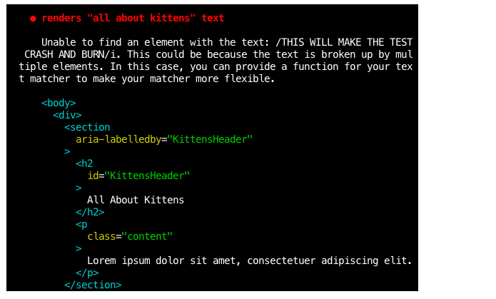

# Objective 2 - Use the React-Testing Library to Test User Interactions With fireEvent

## Overview

For review, the React-testing library is designed to mimic how a human interacts with a website, and just like the React-testing library, these tests focus on UI specifically. This again is just another way to consider the user in design.

We test interface pieces by capturing what we expect to see (or not see) in the DOM using queries. What should (or should not) be there is rendered to a virtual DOM by the library's renderer. This is the DOM node of interest (a certain button, a label containing a specific text, an input with some specific value). Then, we can run matchers against that piece of DOM to assert, for example, that the selection exists in the document or that it's visible.

Let's consider the example of an increment counter that increases by one every time the ```Increment``` button is clicked. Set up like so:

```
import React, { useState } from 'react';

const Counter = () => {
  const [count, setCount] = useState(0);

  return (
    <div>
      <h2>{count}</h2>
      <button onClick={() => setCount(count + 1)}>Increment</button>
      <button onClick={() => setCount(count - 1)}>Decrement</button>
    </div>
  );
};

export default Counter;
```

Our test would look something like the following. This should look similar to the example we walked through in the last objective, with just a few more steps added on. Importantly, we simulate a user click with ```userEvent.click(button)``` and include multiple assertions at the end.

```
import React from "react";

import { render, screen } from "@testing-library/react";
import userEvent from '@testing-library/user-event';
import Counter from "./Counter";

test("increments count when increment button is clicked", async () => {
  // Arrange
  render(<Counter />);
  // Act
  const count = screen.getByText(/0/i);
  // get the button node
  const button = screen.getByText(/increment/i);
  // simulate a user click
  userEvent.click(button);
  // Assert
  expect(count).toHaveTextContent("1"); //passes with 1 because we expect it to be 1 after a button click
  expect(count).not.toHaveTextContent("0");
});
```

### Break the Test

We'll tell you to break your tests often. In the example above, there are multiple expect statements as an attempt to 'break the test'; this is important and intentional. When testing, we want to "break the test" as much as we possibly can; this is the best (and the only) way to ensure that your website won't break when a user goes to try and use it.

## Follow Along

1. ***Change*** ```App.js``` to output different jsx: 

```
  const App = () => {
      return (
        <section aria-labelledby="KittensHeader">
          <h2 id="KittensHeader">All About Kittens</h2>
          <p className='content'>Lorem ipsum dolor sit amet</p>
        </section>
  }
```
2. ***Import*** the App component into our test file ```App.test.js``` and render it. You may pass any props you want! Renders the app component. 

```
  import React from 'react';
    import { render, screen } as rtl from '@testing-library/react';
    import userEvent from '@testing-library/user-event';
    import App from './App';

    it('renders "all about kittens" text', () => {
      render(<App foo="you may inject props!" />);
  });
```

3.  ***Capture*** a piece of the output! We expect some text containing "All About Kittens" to be rendered so we'll use ```queryByText```. This is an example of the ```act``` phase.

```
it('renders "all about kittens" text', () => {
    render(<App />);
    const hasKittensText = screen.queryByText(/all about kittens/i);
  });
```

4. ***Assert*** that the ```hasKittensText``` is actually in the document. If it's not, the value of ```hasKittensText``` will be null. 

```
  it('renders "all about kittens" text', () => {
    render(<App />);
    // IMPORTANT
    // queryByText() returns either the node, or null:
    const hasKittensText = screen.queryByText(/all about kittens/i);
    expect(hasKittensText).toBeInTheDocument();
  });
```

5. ***Try out*** ```getByText()``` as an alternative to ```queryByText()```.

 ```
  it('renders "all about kittens" text', () => {
    render(<App />);
    // IMPORTANT
    // getByText() returns either the node, or **FAILS THE TEST** outright:
    expect(screen.getByText(/all about kittens/i));
  });
 ```

6.  ***Break the test!***. Remember that ```getByText```, as well as the rest of the queries that have ```get``` prefix in their names, will cause a test fail, instead of returning a null value. Queries that have the ```query``` prefix return ```null``` if the element is not found.

```
  it('renders "all about kittens" text', () => {
    render(<App />);
    // no matcher needed, although it may be added to improve readability
    expect(screen.getByText(/THIS WILL MAKE THE TEST CRASH AND BURN/i));
  });
```



7.  ***Capture using different criteria***. We have many other queries available to us. In our component, we have an ```aria-labeledby``` attribute on the ```section``` to inform screen readers that the element ```<h2 id="KittensHeader">All About Kittens</h2>``` is actually a label for the ```section``` element. Let's capture the ```h2``` by label text! The point is to test like a user would. We expect a particular label to be there for our users!

```
it('renders "all about kittens" text', () => {
    render(<App />);
    expect(screen.getByLabelText(/All About Kittens/i));
  });
```

##  Challenge

Use the starter code above to create a test that works for the decrement button.


[Previous](./Object_1.md) | [Next](./Project.md)
