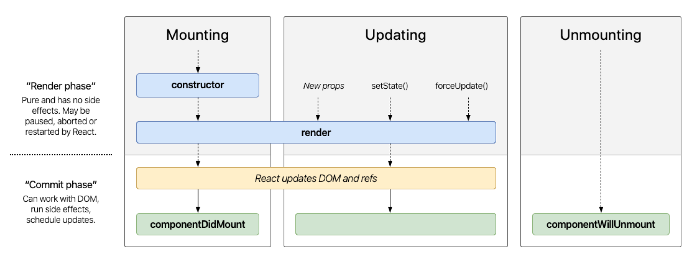

# Web48 - 3.1 Sprint Assessment

## Question 1

####  constructor methods are executed in which phase of Module 2 - The React Lifecycle?

- ```Updating``` 
- ```Rendering``` 
- ```Mouting``` 
- ```Unmounting``` 

#### Answer:   (C) 

## Question 2

####  Fill in the blank for the method that belongs in the empty box.



- ```user``` 
- ```onClick``` 
- ```eventUser``` 
- ```userEvent``` 

#### Answer:   (D) 

## Question 3

####  Which of the following would allow you to mimic a user typing into a text input?

- ```userEvent.type(firstNameInput, 'Tony')``` 
- ```userEvent.type('Tony')``` 
- ```userEvent.click(inputButton)``` 
- ```userEvent.change(firstNameInput, 'Tony')``` 

#### Answer:   (A) 

- Hints: Again, we'd reccomend you check out the [RTL docs](https://testing-library.com/docs/ecosystem-user-event/) to learn more about user events.

## Question 4

####  Which query functions allow you to "wait" for state to be updated after an event has been fired off?

- ```screen.queryByTestId()``` 
- ```All of the Above``` 
- ```screen.findByText()``` 
- ```screen.getAllByRole()``` 

#### Answer:   (C) 

- Hints: By now you get it... check out the documentation!

## Question 5

####  Which query functions allow you to "wait" for state to be updated after an event has been fired off?

- ```screen.queryByTestId()``` 
- ```All of the Above``` 
- ```screen.findByText()``` 
- ```screen.getAllByRole()``` 

#### Answer:   (C) 

- Hints: By now you get it... check out the documentation!


[Previous](./Object_2.md) | [[Module 1](../../Module_1-Class-Components/README.md)
