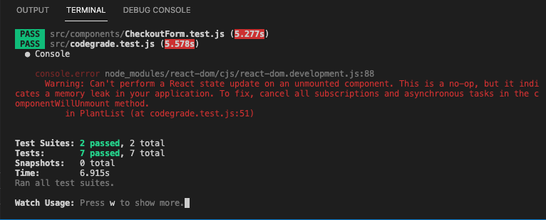

# Sprint Challenge 3.1: Advanced React - React Plants 🌿  - some issues

##  How to use the empjis properly?

- Emojis should be wrapped in <span>, have role="img", and have an accessible description with aria-label or aria-labelledby
  for example: `<span role="img" aria-label="plants"> 🌿 </span>`

## The issue of 


- The answer is (Plantlist.js):
```
componentDidMount () {
    this._isMounted = true;
     
      ...

  }  

  componentWillUnmount() {
    this.setState = (state,callback)=>{
      return;
    };
  }  
```