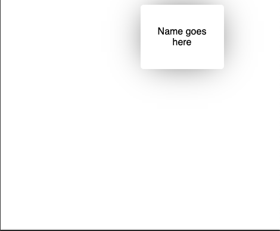

# Objective 2 - Share Data Between Components Using State and Props

## Overview

```Context API``` allows us to create what's known as a ```Context Object```.

```
import { createContext } from 'react';

const ContextObject = createContext();

// usually we'll name the object by the data it will hold - ie UserContext, or MoviesContext, etc...
```

This object gives us two important components to work with a ```ContextObject.Provider``` and a ```ContextObject.Consumer```.

The ```Provider``` method accepts a single prop called ```value```, the ```value``` prop is used to provide our data across our app.

```
<ContextObject.Provider value={dataToPassDown}>
  <NestedComponent />
  <OtherNestedComponent />
</ContextObject.Provider>
```

The context ```Consumer``` consumes and returns the ```value``` provided by the ```Provider```.


## Follow Along

So how do we utilize Context API? First, follow along at this link [here](https://codesandbox.io/s/react-context-api-x7bru).



Diving into the code, you'll notice we're bringing in two hooks from the react library ```useState``` and ```useEffect```.

The ```useState``` hook holds and sets user state. The ```useEffect``` hook performs a pseudo API call that sets "my user" to state.

You'll also notice a ```User``` component rendering ```Name goes here``` as a placeholder.

Now that we have that out of the way, let's talk about the goal we want to achieve. We want to be able to provide data to the child component (based on user data sitting in state) and consume it, using ```Context API```.

1.  The first thing we need to do is make a new folder named ```contexts```. This folder is going to hold all the context objects we create.
2.  Inside that folder we're need to create a new file named ```UserContext.js```. This is where we're going to create our first context object!
3.  Inside that file, we're going to create our ```UserContext```.

Now you may be thinking wow! Only two lines of code? Yep! Only two lines of code and we have successfully created our ```UserContext```.

Now that we have created our ```UserContext``` let's import it into our ```index.js```.

```
import { UserContext } from '../contexts/UserContext';
```

After creating and importing our ```UserContext``` we can start providing our user data across our application.

To do so, we need to wrap all of our child components inside of our ```UserContext Provider``` and pass it a prop of ```value```, this prop contains our user state.

```
return (
    <UserContext.Provider value={user}>
        <div className="container">
            <User />
        </div>
    </UserContext.Provider>
);
```
Doing so, we allow all child components of our ```UserContext Provider``` to consume the value(s) that come from the hook; in our case, the value is a user object.

## Challenge

Using an old project, go in and add a context item for some of the state there. Then pass the data into the context provider.


[Previous](./Object_1.md) | [Next](./Object_3.md)