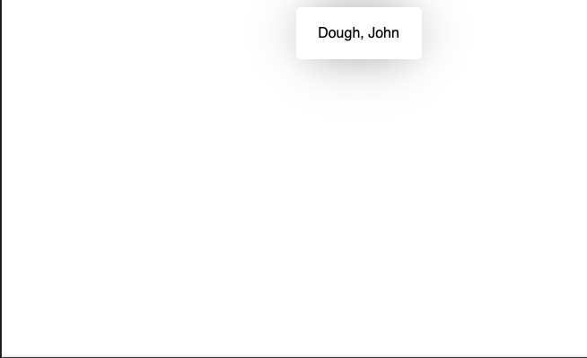

# Objective 3 - consume data from a context object in nested components

##  Overview

Consuming the data passed into the provider is the final step for using the Context API. We will use a context hook for this, though keep in mind that you can use render props as well.

```
import { useContext } from 'react'
import { ContextObject } from '../contexts';
...

// inside the component
const myData = useContext(ContextObject);

// or you can destructure the data like this:
const { someData, moreData } = useContext(ContextObject);
```

Now you're ready to use the data in your component!

##  Follow Along

In the previous objective, we created our ```UserContext``` hook, and passed our data into the provider. Now it's time to consume it.

To do so import the ```useContext``` hook from the react library and our ```UserContext```.

```
import React, { useContext } from 'react';
import { UserContext } from '../../contexts/UserContext';
```

After importing our UserContext, we will consume the data from it.

```
const user = useContext(UserContext);
```

Finally, we can render our user to the screen!

```
return (
    <div className="profile">
        <p>
            {user.lastName}, {user.firstName}
        </p>
    </div>
);
```

Our app should look like this if everything is correct.



The completed follow along code can be found here (Links to an external site.)

## Challenge

Continue working in the app you chose in the last objective. Now that you have rendered the context provider, and passed in your data, you need to consume that data where it's needed.


[Previous](./Object_2.md) | [Next](./Project.md)
