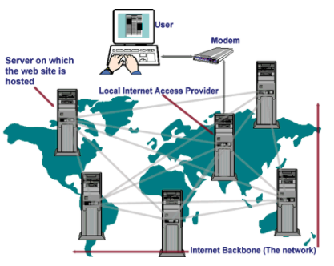

# Objective 1 - Explain How the World Wide Web Works

## Overview

The "world wide web" (which we'll refer to as "the web") is a part of the internet - which is itself a network of interconnected computers. The web is just one way to share data over the internet. It consists of a body of information stored on web servers, ready to be shared worldwide.

### Web Servers

The term "web server" can mean 1) a computer that stores the code for a website or 2) a program that runs on such a computer.

The physical computer device that we call a web server (like the one shown below) is connected to the internet. A web server stores the code for different websites to be shared across the world at all times. When we load the code for our websites, or web apps, on a server like this, we say that the server is "hosting" our website/app.

However, the server itself needs some code to tell it what to do. That software program is called - a web server! Its main purpose is to "serve" web pages it retrieves from your project code to users upon request.

While hosting websites has traditionally been a fairly involved task, nowadays, it is quicker than it ever has been before. Gone are the days of setting up a server program through services like Apache or Windows IIS, renting the physical server space from a large company, or buying server hardware.

### How Servers Share Info

When you set up app hosting, what's the first thing you always do? You open a browser and navigate to the web address to see it live, of course! So how does that work? There are a couple of key components we want to look at that are part of this process.

### Domain Names and URLs

In 1984, a couple of decades after the first computers and networks were invented, the Domain Name Service (DNS) was introduced. This was a concept where computers could distinguish themselves from one another. As a result, six domains that you will probably recognize were introduced: edu (education), gov (government), mil (military), com (commercial), net (network resources), and org (organization).

Just a few short years later, in 1991, the worldwide web network was opened to the world and incorporated the new HTML computer language. HTML uses specifications for Uniform Resource Locators (URLs). These URLs became (and remain) the universal standard for locating website addresses.

By definition, a URL is a formatted text string referring to the location of a resource on a computer network (most commonly the web). Typically, these resources are web pages, but they can also be text documents, graphics, programs, or pretty much anything that can be stored digitally.

### Bringing It All Together

Combining this all together, we learn that computers can connect to the internet via the world wide web, locate a specific server computer through a URL and domain name, and retrieve information or resources from that server.›

##  Follow Along

Now that you know how the web works, read [this article](https://www.doteasy.com/domain-email-and-website-hosting-articles/how-do-websites-work) and jot down 2-3 things you are learning.

## Challenge

Research what it means to deploy apps to a server, and the difference between static and dynamic applications.

[Previous](../README.md) | [Next](./Object_2.md)
