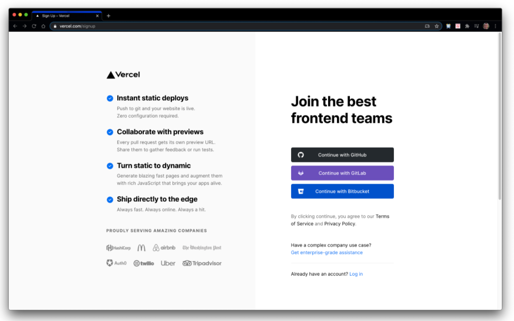
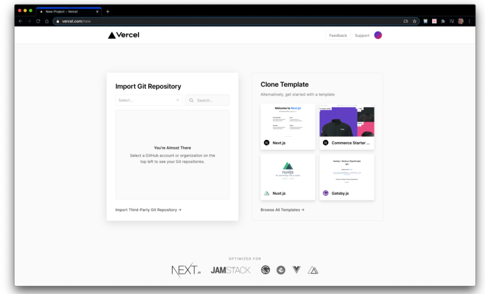
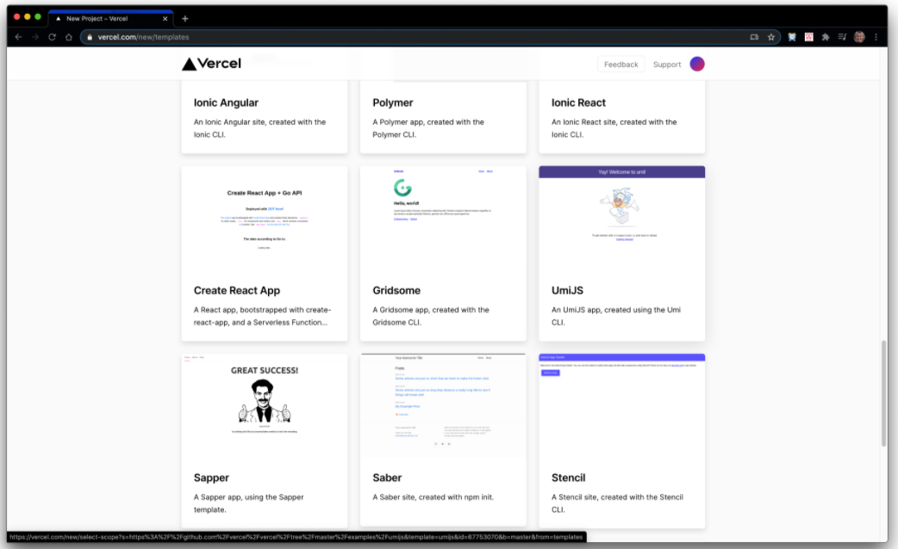
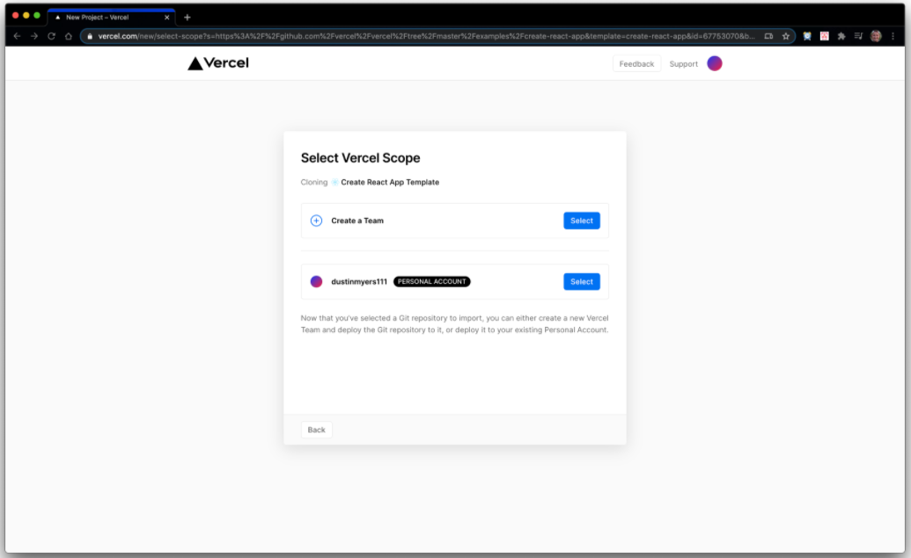
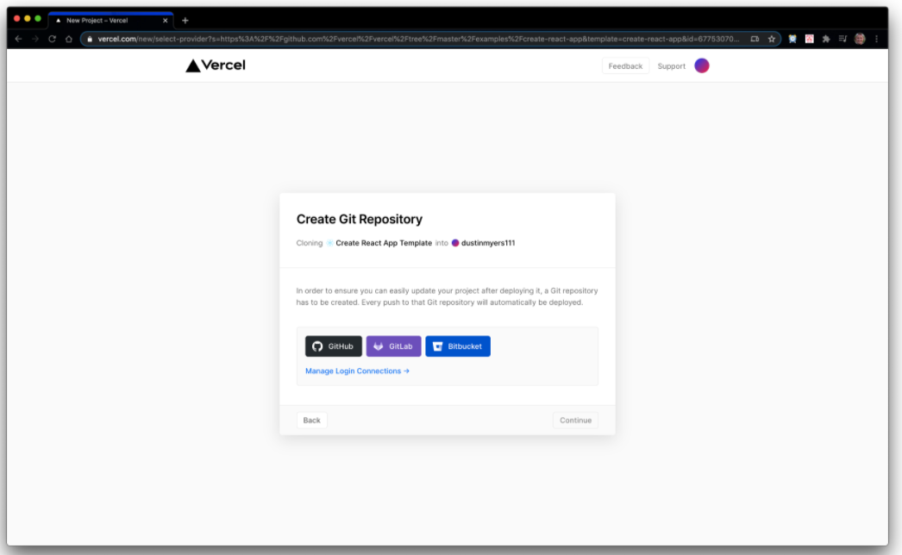
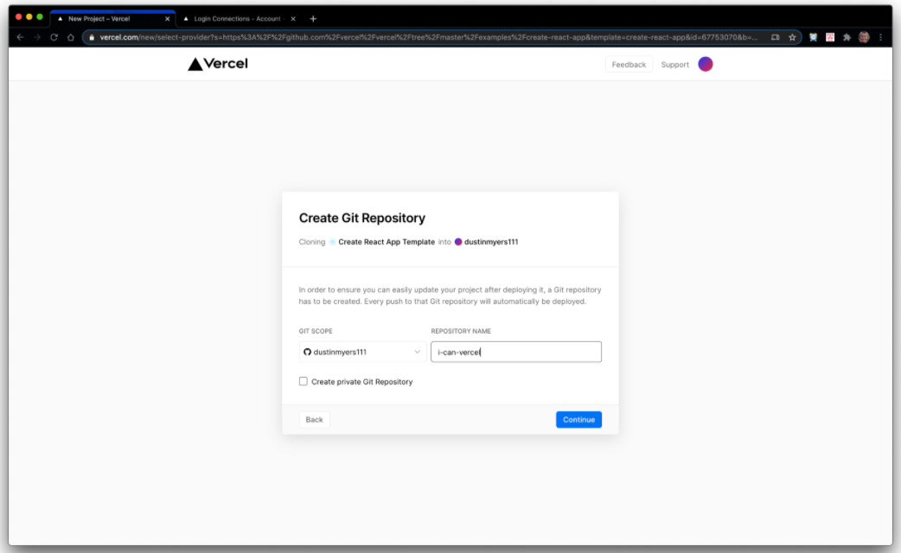
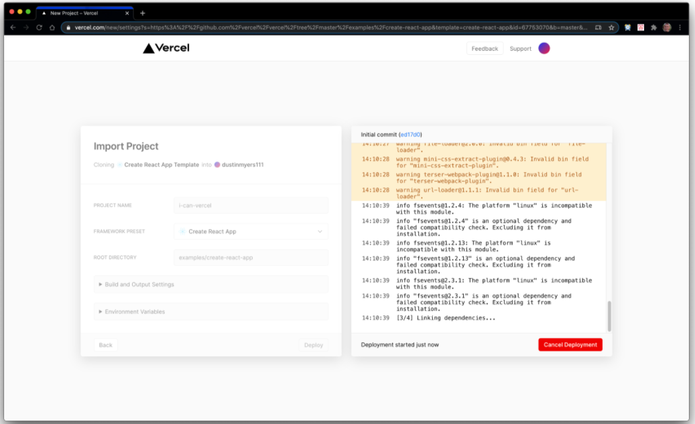
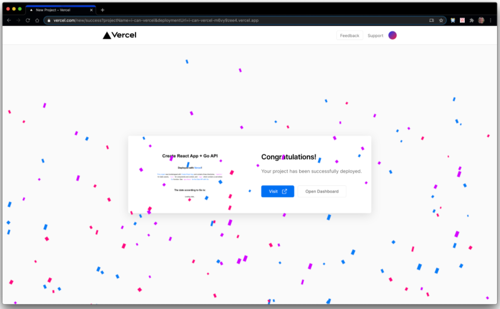

# Objective 3 - Demonstrate the Ability to Deploy and Maintain a React App Using Vercel

##  Overview

To start, please go to [Vercel](https://vercel.com/) and sign up for an account with your Github profile. Once you do that, move on to the follow-along section to deploy a React app using Vercel.

## Follow Along

Getting started with Vercel takes just a few steps. After that, you can get up and running with a new project in less than a minute.

### Account Creation & Onboarding

Let's start by creating a new [Vercel account](https://vercel.com/signup) You can make a new account by logging in with GitHub. You'll immediately be taken through an onboarding flow, as shown below.

Sign up with GitHub and authorize Vercel with your GitHub account

Here is a list of all the templates you can create straight from Vercel. Scroll down until you see the "create-react-app" template. Choose that template.

You will click on browse all templates from this screen, then scroll down until you see the "create-react-app" template. Choose that template.

Choose your account to manage projects for free. If you create a team account, you will be charged after a free trial period.

Choose GitHub for your git platform. This will allow Vercel to create a new React app and push the code for that project to your GitHub account.

Give your Vercel project a name. Remember the name so you can name the git repo the same thing in the coming steps.

Then click on the git scope dropdown and choose Add GitHub Org or Account. A new window will open to allow you to "install" Vercel in your GitHub account. Click on Install.

Choose a name for your git repository. Then, use the same name you chose for your Vercel project.

Click on continue to create a new React app, deploy it, and push it to your GitHub!

Celebrate when it is finished! Now you can visit the deployed site or go to the project dashboard in Vercel.

## Challenge

Do you have a domain name? Maybe for your portfolio site? Follow the instructions [here](https://vercel.com/docs/more/domains/transferring-a-domain?query=domain_) to transfer your domain to Vercel and deploy and maintain your project with Vercel. If you don't have a domain name yet, look through the Vercel documentation and find an interesting guide [here](https://vercel.com/guides)

[Previous](./Object_2.md) | [Next](./Understanding.md)

